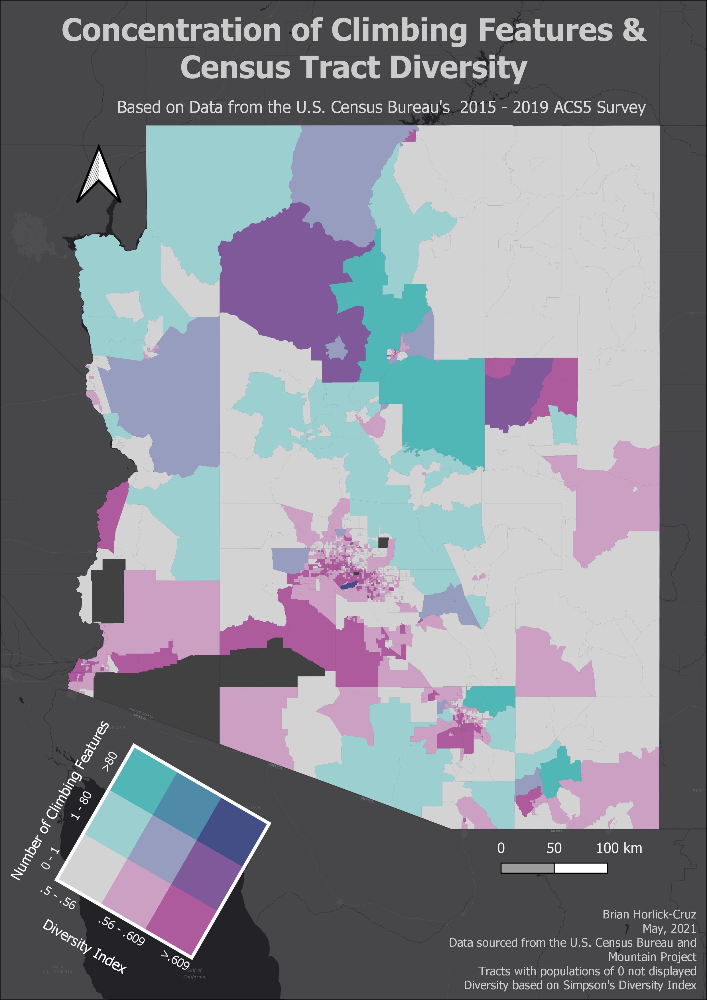
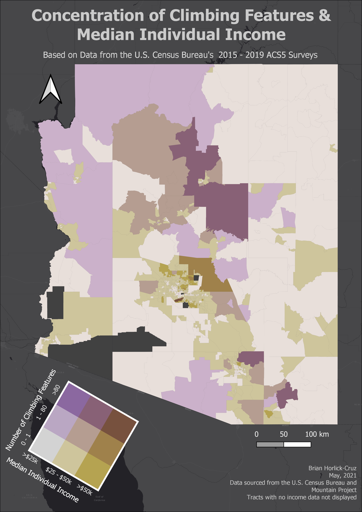
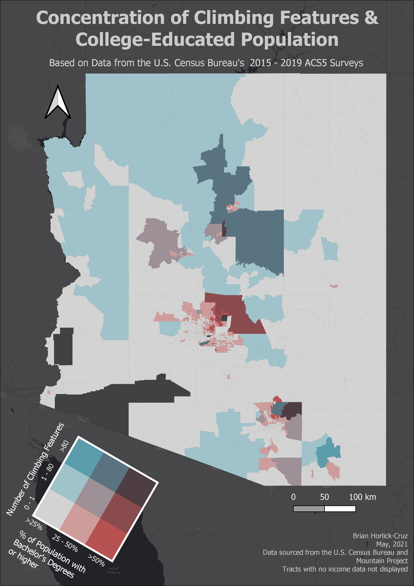
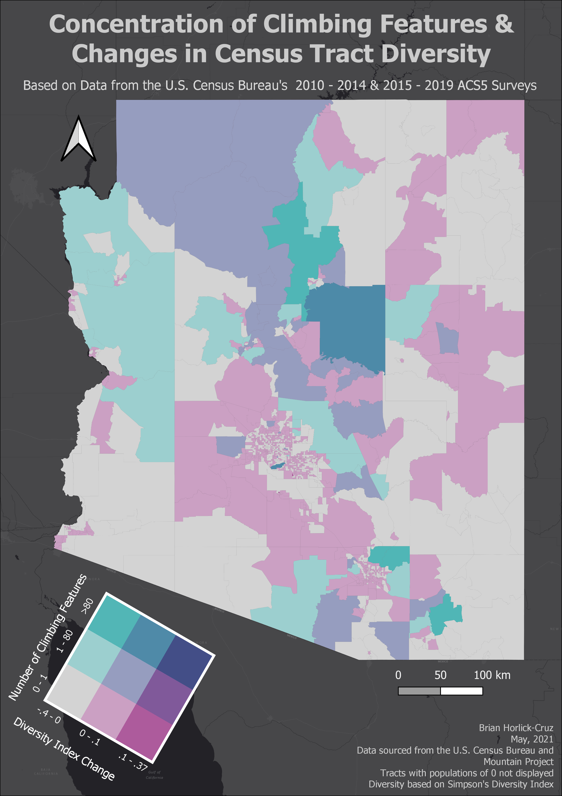

# Crag Equity: Local Demographics and Outdoor Rock Climbing Sites in Arizona

## Introduction
Recreational rock climbing has for most of its history been predominantly practiced by upper-middle class white people. Recent research indicates that this is still the predominant nature of participation in climbing activities, with a recent large-scale survey indicating approximately 90% of climbers identify as white, while a 2019 survey of over 500 climbers further revealed that 72% possessed at least a bachelor’s degree and 48% had personal incomes of over $50,000 (Carter et al., 2020; Maples et al., 2019). The relative uniformity of these demographics, however, may not always be aligned with those of the areas surrounding popular rock climbing destinations. Developing a greater understanding of these disparities may be of use for both recreation and social equity activists wishing to improve both the diversity of outdoor climbing communities and strengthen relationships between recreationists and local communities in popular destinations. This research therefore aims to further knowledge concerning issues of demographic diversity as they concern rock climbing activities in the state of Arizona, giving special attention to race and ethnicity, individual income, and education levels.  

## Data Collection 

Demographic data for this study was sourced from the U.S. Census Bureau’s API, while geospatial data on the location of rock climbing features were generated using a combination of CSV’s downloaded from Mountain Project’s Arizona pages. Demographic data was downloaded at the census-tract level from the 2010 – 2014 and 2015 – 2019 ACS5 surveys, and included: the total population of  census tracts; total populations of people who identify as white, black, Asian, Hispanic, Native American, Native Hawaiian and Pacific Islanders, Other races, and two or more races; median individual income; and total population with bachelor’s degrees.  
  
## Data Processing

Census data were processed using R Studio. Census tract data was downloaded for the entire state in three sets: two sets of demographic data from the two periods of interest without geometries, and a third one that included geometries. This set up was necessary due to the subsequent creation of a diversity index using the “Vegan” package in R, which requires all variables to be numeric. Once census data was loaded into R, a new diversity index variable was created for data from each year using the “diversity” function of the “Vegan” package, which calculated Simpson’s Diversity Index for each census tract based on the 8 racial and ethnic groups listed above. This approach was based on the method used by USA Today to quantify diversity in the U.S. in 2001, with scores of 0 indicating no diversity and scores of 1 indicating “infinite diversity” (Schilling, 2002). Additionally, the percentages of the population who have bachelor’s degrees were calculated and added to the datasets as new columns. The demographic datasets were joined together with the dataset that included geometry, creating a single spatial object with all of the relevant variables. Finally, change over time variables were calculated for the diversity indices and median income information, and the data set was exported as a .geojson file. Please see Appendix A for an annotated, reproducible HTML markdown script detailing this process.  

Separately, the point data showing climbing sites in Arizona was created using Microsoft Excel and QGIS. The data were produced by exporting over 120 CSV files listing rock climbing routes using Mountain Project’s “Export CSV” function, which is meant to help climbers generate lists of specific climbing routes they would like to try. All routes from Arizona were exported and manually combined to create a single master spreadsheet listing all documented climbing routes in the state, which amounted to over 10,000. This table was then imported into QGIS and given geometry based on the longitude and latitude columns included for each entry. Finally, to show only distinct climbing “areas” rather than individual routes, the data were dissolved based on the “area” column, reducing it to a list of 1,711 routes at distinct climbing areas. For the purpose of this project, I have opted to use the term “climbing feature” to describe these observations, as they include cliffs, mountains, boulder fields, and canyons.  

Both the climbing features and demographic data were then combined in QGIS using the “Count Points in Polygon” tool. This generated a new shapefile showing all of the demographic data along with a new column listing the total number of climbing features found in each census tract. This shapefile was used in combination with the original demographic one to create a series of bivariate maps exploring the relationships between the presence of climbing features and the variables of interest. Bivariate color schemes were based on those created by Joshua Stevens (Stevens, 2015). To further strengthen the results of the analysis, the tabular data from the demographics & climbing shapefile were exported as a new CSV and imported into Stata for statistical analyses. In Stata, a binary variable was created to categorize each census tract based on the presence of climbing features, and a series of T-tests were conducted to observe any statistically significant differences in the variables across this distinction. Those for which statistically significant differences were identified were further assessed using order of least squares regressions to characterize the strength of the correlations. Any correlations that appeared to be of interest were also tested using the change-over-time variables which were calculated in R Studio to see if they indicated any sorts of temporal trends.  

A final web map was produced to illustrate the data for the 2015 – 2019 census data. This was done in QGIS, with a bivariate class variable being manually created in order to symbolize the correlation appropriately. The web map was thereafter uploaded on the researcher’s Github portfolio.

## Results

Out of Arizona’s 1,526 census tracts, 94 contain rock climbing features which are publicized on Mountain Project. The 5 census tracts with the highest concentrations are: Tract 40.52 in Pima County (290 features), Tract 4 in Cochise County (137), Tracts 16, 22, and 15 in Coconino County (114, 107, and 104 features respectively). The average number of climbing features per census tract is 18.20 and the median is 3. Moreover, the mean and median Simpson’s Diversity Index scores for tracts overall were 0.557 and 0.546 respectively.   Geographic distributions of these data are displayed in figures 1 and 2 below.  Bivariate maps were subsequently produced comparing the presence of climbing features to diversity as well as the other variables of interest, shown in figures 3 – 6. 

Figure 1
 

Figure 2
 

Figure 3

Figure 4
 

Figure 5
 
Visually, these maps appear to indicate potential negative relationships between local demographic diversity and climbing features, positive ones between education and climbing features, and ambiguous ones concerning individual income. Several statistical tests thereafter clarified the scope and nature of these correlations.

At the .05 significance level, overall diversity of within census tracts was determined to be statistically significantly less in tracts where rock climbing sites are present, with non-climbing tracts having a mean Simpson’s Diversity index of 0.584 compared to 0.559 in tracts with climbing. Moreover, the populations of people who identify as black, Asian, Native Hawaiian/Pacific Islander, other races, and two or more races were shown to be statistically significantly lower in census tracts with climbing features. Hispanic, white, and Native American populations showed no statistically significant differences when grouped in this way. These distinctions are visualized in Figure 6. Regression analyses of all of these relationships indicated minimal causality on the part of the presence of climbing features, with all relationships having R2 values of less than .01. This indicates that, from the distinctions between overall diversity to the distinctions found within each racial or ethnic group, the presence of climbing features themselves is related to, but not a cause of decreased diversity. Complete results of T-tests and Regression analyses are compiled in Appendix B.

 

Figure 6

Further testing showed no statistically significant distinctions between median individual income with the presence of climbing features, but census tracts with climbing features were found to have statistically higher (at the .05 level) percentages of their populations with bachelor’s degrees  on average (24% vs. 20%). Much like the correlations between diversity and climbing features, however, regression analyses showed minimal causality on the part of climbing features (R2 = <.01).
To examine these relationships over time, the same statistical tests were carried out using the change-over-time variables for the diversity index, income, and education. T-tests revealed that there was only a statistically significant difference in changes in diversity (at the .05 level) over time in census tracts with or without rock climbing features. A regression analysis indicated a slight negative correlation between climbing sites and growth in diversity, however with a very low causal relationship (R2 = <.01). These changes are illustrated below in Figure 7. 

Figure 7

## Discussion & Conclusion

Given the data presented here, it is apparent that there is a small, but statistically significant negative correlation between census tract diversity and the presence of rock climbing features. Both tracts with and without climbing features have populations with nearly identical white and Hispanic majorities, but those with climbing features have significantly fewer residents of all other racial groups except for Native Americans. This correlation also stands true for census tract diversity as it changed between the estimates of the two 5-year periods of study, meaning that census tracts with climbing features were more likely to see decreases in diversity. Additionally, there is a slight positive correlation between the presence of rock climbing features within census tracts and percentages of local populations who hold bachelor’s degrees; however, climbing features are not linked to any particular trends in changing percentages of populations with bachelor’s degrees over time for the two survey periods compared.  

This correlation does not, of course, indicate any sort of causality. There are many other factors which may affect these patterns as well, such as the lower population numbers and limited work opportunities that accompany life in more rural settings where most rock climbing sites are situated. Indeed, it is entirely plausible that decreasing diversity may result from people leaving more rural tracts for urbanized areas with greater career prospects. That said, it is difficult to explain the slight positive correlation between education and rock climbing sites, which goes against what one might expect with decreasing diversity, and numerous other social factors are likely driving this observation.  

For the data studied here, it seems that the local demographics do skew heavily white, which is much aligned with the climber demographics presented by Carter et al. (2020). However, some ambiguity does arise based on the Census Bureau’s categorization of Hispanic as an ethnicity rather than a race. The Hispanic populations of tracts with rock climbing features was notably higher than the population that identify as white alone, but this distinction was not made by Carter et a., who described approximately 3-4% of rock climbers as being Hispanic (Carter et al., 2020, p. 6). Further research on this topic, especially localized to Arizona and the Southwest, should therefore explore different methods for gauging diversity. This may present different results than what was found here.  

Moreover, the other variables of interest, correlations notwithstanding, were both observed to be lower than what Maples et al. have shown to be the norm for typical rock climbers. The average rate of bachelor’s-degree holders in census tracts with climbing was around 24%, which is just over 1/3 of the typical climber demographic. Additionally, median personal incomes for both tracts with and without climbing features were below $35,000, which, although no median was described by Maples et al., is likely below that of their study given that 48% of their sample had incomes above $50,000 while one in 10 had six-figure salaries (Maples et al., 2019).  

It must be noted that the figures being used for comparison here are from surveys of rock climbers in Wester Virginia, Colorado, Utah, and Ontario, which may not necessarily be reflective of rock climber demographics in Arizona. Additional research on the demographics of local rock climbers may yield different results. It must also be noted that the rock climbing sites observed int his study were only those that have been published on Mountain Project. It is entirely likely that there are many underreported climbing locations and newly developing ones which have not yet been publicized. Given these limitations, this research should thus be treated as a starting point for subsequent investigations into rock climbing and localized demographics.

## References:
Carter, David P., Hutson, G., Lam, P., Rose, J., & Furman, N. (2020). The self-governance challenges facing climbers, with examples from Utah, Colorado, & Ontario. Journal of Outdoor Recreation and Tourism, 31, 100323. https://doi.org/10.1016/j.jort.2020.100323

Maples, J., Bradley, M., Giles, S., Leebrick, R., and Clark, B. (2019). “Climbing out of Coal Country: The Economic Impact of Rock Climbing in West Virginia’s New River Gorge.” Journal of Appalachian Studies, 25(2): 184-201 

Schilling, M. (2002). “Measuring Diversity in the United States.” Math Horizons, 9(4): 29 – 30.
