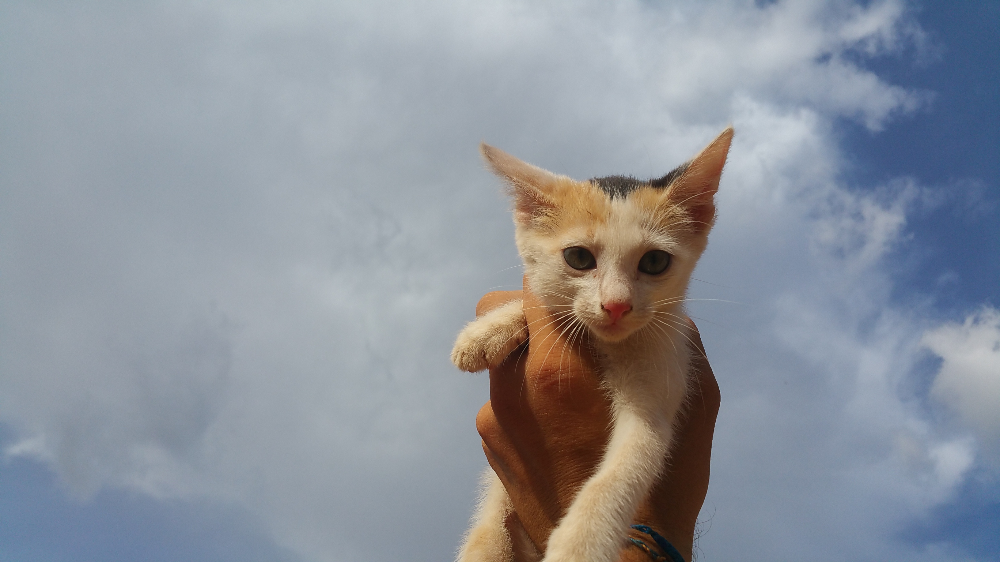
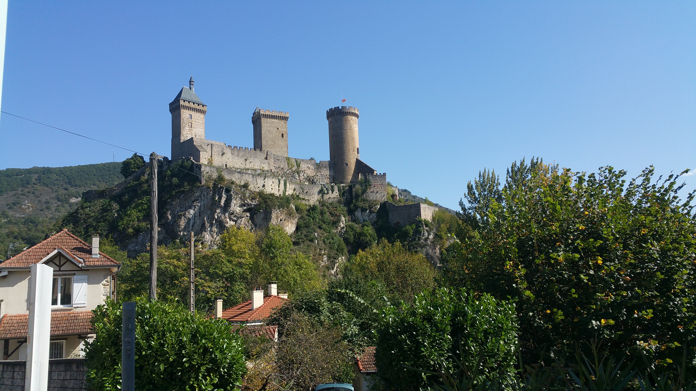
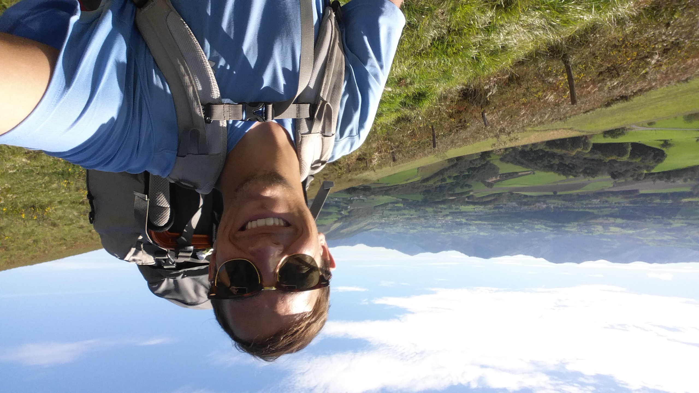
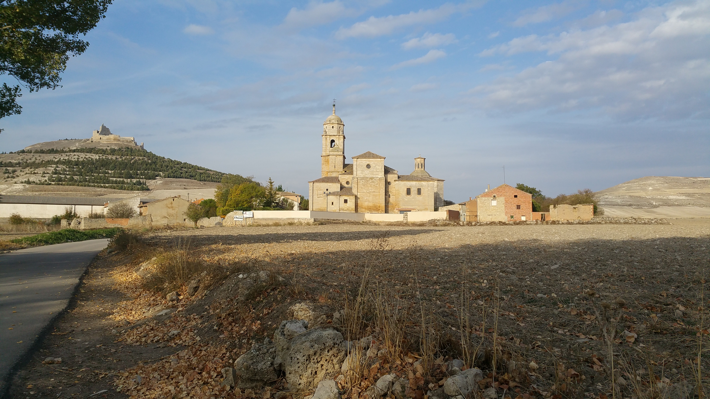
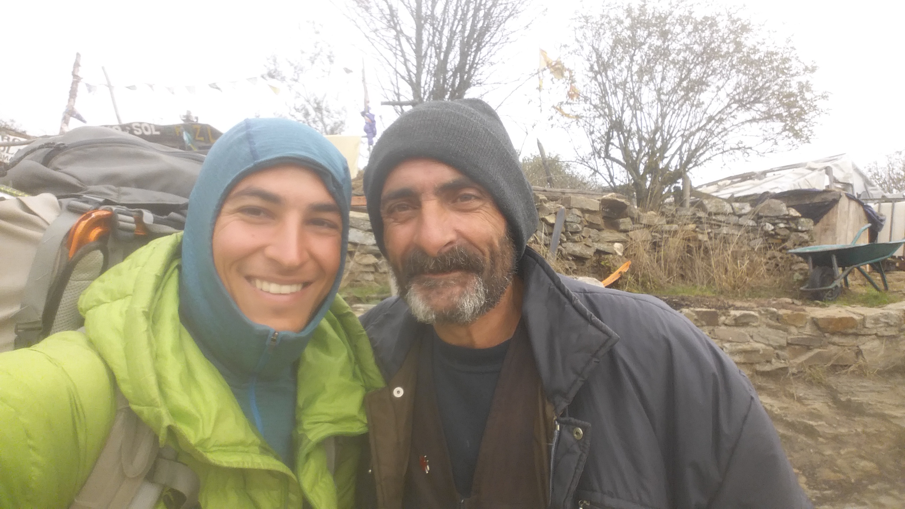
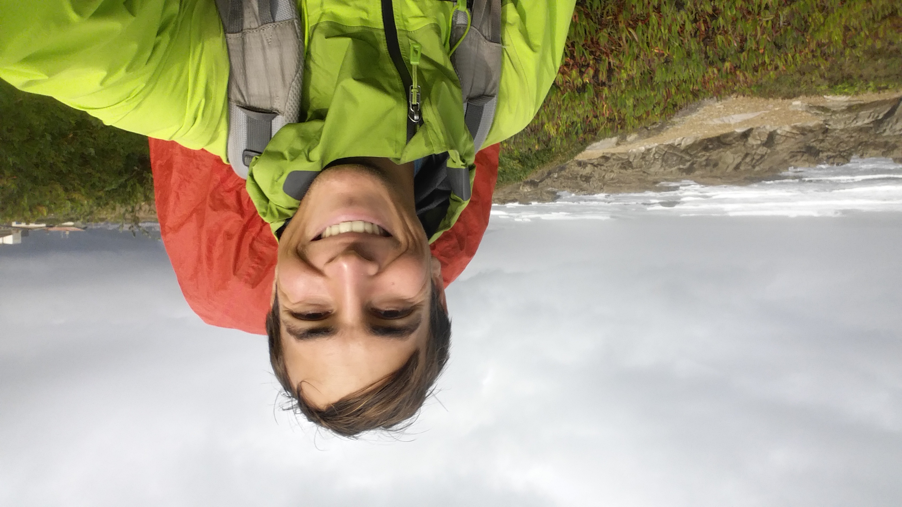
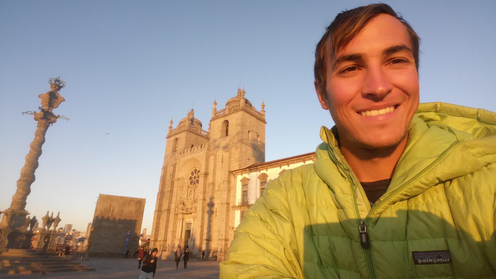

## Sometimes, life takes you by surprise...

In early September, 2017, I found myself alone and out of work on the streets of Paris with nearly a year's worth of professional plans completely lost. My Peace Corps program had just been [evacuated due to a serious kidnapping threat against our volunteers by religious rebel groups in Burkina's northern regions.](https://www.peacecorps.gov/news/library/peace-corps-burkina-faso-volunteers-evacuated-safely/) After a few tumultuous and fast-paced days, I finally had some time to reflect on everything that had happened. It was a painful event, really: daily exchanges with my friends and neighbors in Kossouka were suddenly wiped away from my life; I had no immediate job prospects or sense of direction; I missed my cat.

Tiiga, my Burkinabe cat.

After visiting a few friends and fellow volunteers across the country, I decided to head south to "get in touch with my roots." I had always wanted to visit the town of Foix in the foothills of the Pyrenees, where my great grandfather was born and raised before emigrating to Puerto Rico. Finally having the time and means to do so, I hitched my way to the south in an effort to retrace my great grandfather's footsteps.

  

Upon reaching Foix, I began to feel the need to spend some extended time in deep reflection; I felt inspired to walk.

  
 
 The castle at Foix
  

I learned that from the nearby town of Lourdes, I could begin walking trails that would eventually lead me to El Camino de Santiago--the famous and historic Catholic pilgrimage route leading to the shrine of Saint James in Santiago de Compostela, Spain. With ample time to wander and reflect, I felt that following El Camino was, well, the right thing to do. And in doing so, this difficult moment in my life soon turned into one of my biggest and most memorable adventures.

Crossing the Pyrenees mountains from France.

From Foix, I hitchhiked over to Lourdes and began what would become a 45-day thru-hike through the French Pyrenees, across northern Spain, and even down the coast of Portugal. Although I went out alone, there is always company on the Camino, and I shared countless wonderful experiences with new friends and transient passersby.

Typical Camino scenery.

One of the modern-day Knight Templars who hosted me for a night in Galicia.

Walking along the Portugese coast.

Eventually, I ended up passing through Santiago de Compostela and continuing to walk south, finishing my journey in Porto, Portugal. This walk gave me the distance that I needed from the Peace Corps evacuation to help process everything in a healthy way, and led me to find a next step moving forward through applying for a teaching job in France.

My final stopping point at the cathedral in Porto.
