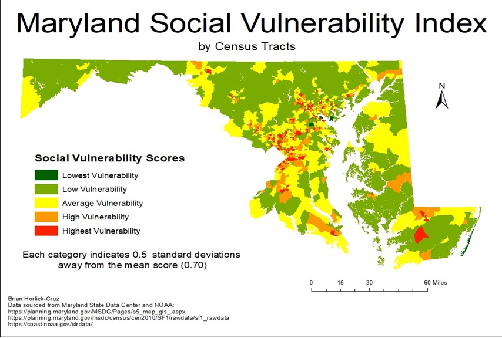

## How will Climate-Change-Driven Coastal Flooding Impact Maryland's most Economically Vulnerable Residents?

In the coming years, climate change is projected to lead to rising sea levels and coastal inundation the world over. These floods will likely displace millions of people who live in coastal towns and cities, which can be devastating for people living in poverty or socially difficult situations. Using 2010 census data and projected sea level rise data from NOAA, this analysis aimed to examine if there are any relationships between high social vulnerability and vulnerability to displacement from coastal flooding.

Central to this project was the creation of a Social Vulnerability Index (SVI).  An SVI is an index which attempts to create a standardized measure of "social vulnerability." This SVI was constructed based on proportions of households at the census-tract level which have 1) members over the age of 75, 2) single-female heads-of-households with children, 3) more than 7 inhabitants, and 4) are renter-occupied, along with 5)  proportions of the population which are non-white.  These proportions were then summed, with higher-scoring census tracts indicating higher vulnerability, and thereafter compared with the NOAA projections for sea-level rise ten (two feet) and twenty (five feet) years in the future. 

If any, it appears as though there may be a negative correlation between high social vulnerability as defined by the index and exposure to projected SLR.  From a total of 291 census tracks that have some degree of projected risk of exposure to sea level rise, there are only 11 high-SVI census tracts in the 2-foot rise scenario and 12 high-SVI census tracts in the 5-foot scenario.  In the more severe 5-foot sea level rise scenario, the mean area of land loss among these high-SVI census tracts is 3%, with the highest one being 11%.  These are all well below the projected percentages of land loss for the most severely affected census tracts (over 30% land-loss).

