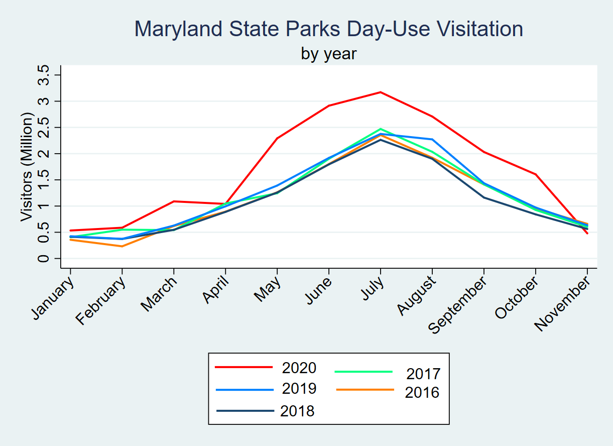
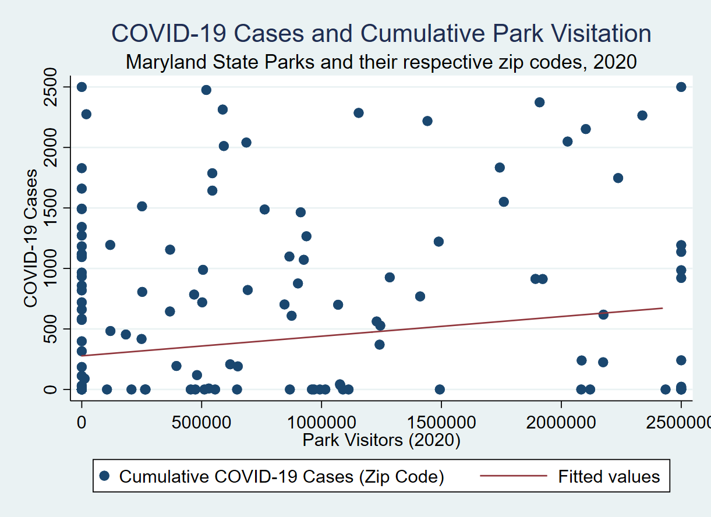
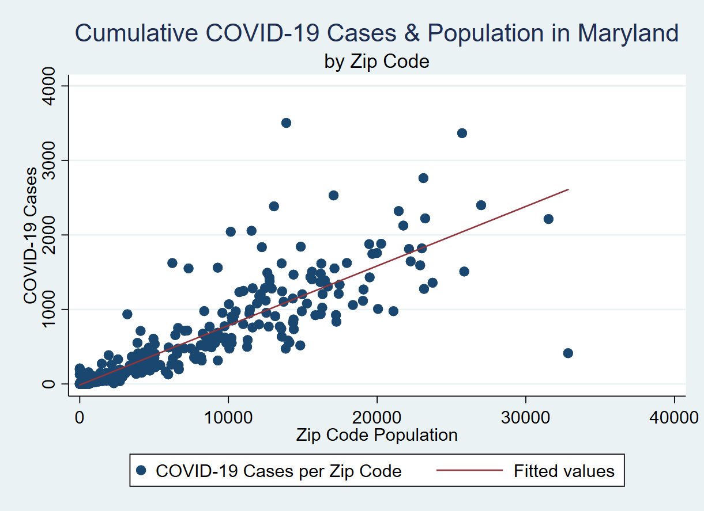

## How Did the COVID-19 Pandemic Impact Green Spaces in Maryland?
---

This analysis aimed to answer two principal questions: (1) how has park visitation changed in relation to the COVID-19 pandemic and its associated shutdowns, and (2) what are the relationships between park visitation and regional trends in COVID-19 cases? I approached these questions using data from a the Maryland State Parks Office, the Maryland Open Data Portal, and the Maryland State COVID-19 data portal.

---

2020 was marked by an unambiguous increase in state park visitation in Maryland, with average monthly increases of 457,463 visitors. This trend initially became pronounced in February, but leveled off by March and remained stable through April. This pattern coincides with the declaration of a state of emergency due to COVID-19 (March 5), closures of schools and public spaces (March 16th), and the statewide stay-at-home order (March 30th). Thereafter, the month of May began a period of substantial increases in visitation, with an increase of 900,258 day-use visitors that month and peaking at 995,814 in June. This corresponds closely with the commencement of the state’s reopening from strict social distancing measures, the first phase of which began on May 15. The most recent uptick in cases thereafter began following the state’s entry into the third and final stage of reopening on September 21st, with cases increasing by 125% between September and October and 255% between October and November (WBALTV, 2020).

 The above graph was produced using data on day-use visitation from the Maryland State Park Service, which were reformatted and graphed using Stata.

---

 Chi-2 tests of independence as well as OLS regression analyses indicated no statistically significant relationships between increases in park use or high park visitation and COVID-19 case numbers; however, there was a strong (r = 0.765) relationship between COVID-19 cases and zip code population. This supports the notion that the spread of COVID-19 is not strongly associated with outdoor recreation and public parks use, assuming that standard social distancing protocols are followed. 

   

