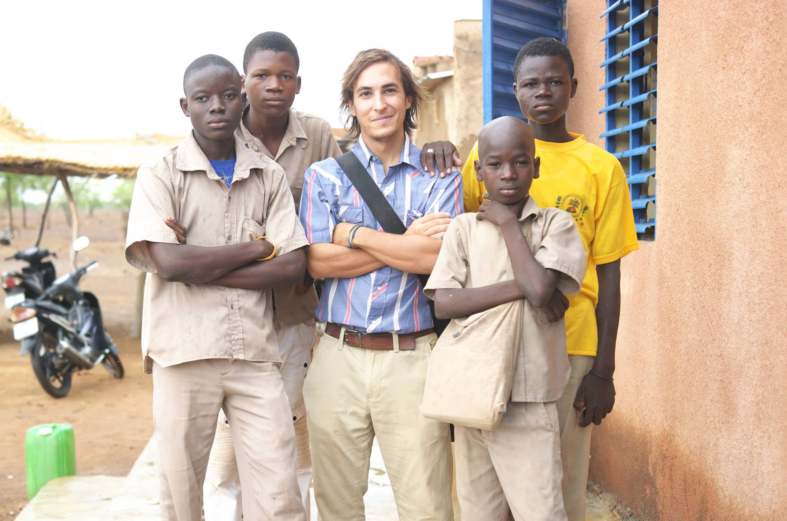

## Maana Waana?

I was an education volunteer with the U.S. Peace Corps, serving in the village of Kossouka in the north of Burkina Faso. My volunteer cohort was the last one to close service (COS) in the country, as the Peace Corps conducted a countrywide program evacuation in September, 2017 due to a growing threat of extremist activity in the region.

### L'Etude de Milieu

Following two months of intensive language and intercultural communication training, all Peace Corps volunteers spend their first three months in their assigned work site conducting a needs assessment study while developing a strong rapport with the locals.  [This project](etude_project/Etude Report.odt) offered me an opportunity to put all of my undergraduate ethnographic research methods into practice, investigating the history of the village, conducting in-depth interviews, facilitating focus groups, and participating in daily village activities.

### Teaching

My primary assignment was to act as the head English teacher for the 5eme classes in the village (the equivalent of American 6th grade). This required me to work between two schools, with each class having over seventy students. The challenges were manifold, whether it was communicating new vocabulary and grammar concepts across two--and often three--languages, designing lessons with no resources apart from chalk and scarcely legible chalkboards, or chasing a stray donkey out of the classroom. The work was rewarding, however, as I cultivated strong relationships with many of my students and colleagues as we worked and learned together.

### Community Organizing and Other Projects

When I wasn't teaching, I was busy planning and executing a variety of other projects that would support local communities. Along with two fellow volunteers in the region, I carried out a summer campaign creating world maps for three local schools, all of which had geography coursework as part of the national curriculum, but lacked any sort of map apart from one teacher's personal atlas. Before this, most children and adults had almost know knowledge of the physical and political boundaries within Burkina Faso, let alone the world.  
I also assisted in planning and overseeing a large gender sensitization program for National Women's day in 2017, which featured interactive workshops for boys to learn about women's issues, an all girls soccer match, and an all girl's bicycle race. This programming was developed with inspiration and guidance form Michelle Obama's Let Girls Learn campaign.

 

### Administrative Support and Program Backstopping
Due to my outstanding performance throughout the first year of my service, I was selected by the program headquarters to act as both a regional security warden and a volunteer trainer for the incoming cohort of volunteers in 2017. For the 2017 volunteer cohort, I provided mentoring and model teaching over the course of one week of their training program, facilitating cross-cultural instructional methodology workshops and reflection sessions. I further received training on planning and executing countrywide emergency lockdown and evacuation protocols; this training was, unfortunately put to use in September 2017, at which point the entire Peace Corps Burkina program was evacuated due to ongoing regional security threats.

