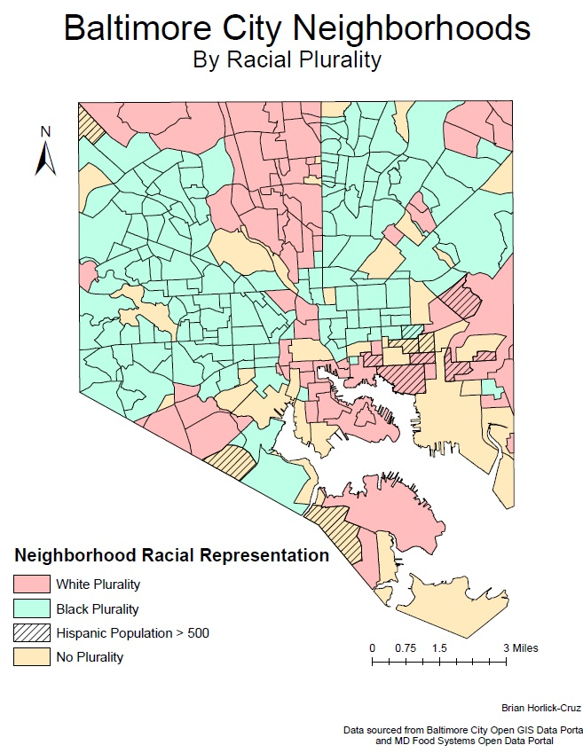

## Mapping the Relationships between Race, Income, and Food Access

 Using ArcMap, neighborhoods were configured to display the racial groups that have pluralities in their populations or the median household incomes. Data on locations of different food sources (Supermarkets, small grocery stores, farmers' markets, and fast food restaurants) were then laid over the neighborhoods and concentrations of each source were calculated per square mile.
 

  

 Similarly, neighborhoods were regrouped to be analyzed based on median household income, displaying them as either above or below 200% of the federal poverty line. The same analyses were carried out comparing food access to household income. 

 
 
 
Initial Analyses showed that the total density of food stores across white-plurality neighborhoods is lower than that of black-plurality areas in all categories but fast food chains.  Neighborhoods with high Hispanic populations show a much greater density of all food resources except for farmers markets, urban farms, and public markets.
They further indicated that lower-income areas have slightly greater access to local markets, significantly greater access to small food stores, and lower access to fast food chains and supermarkets.

