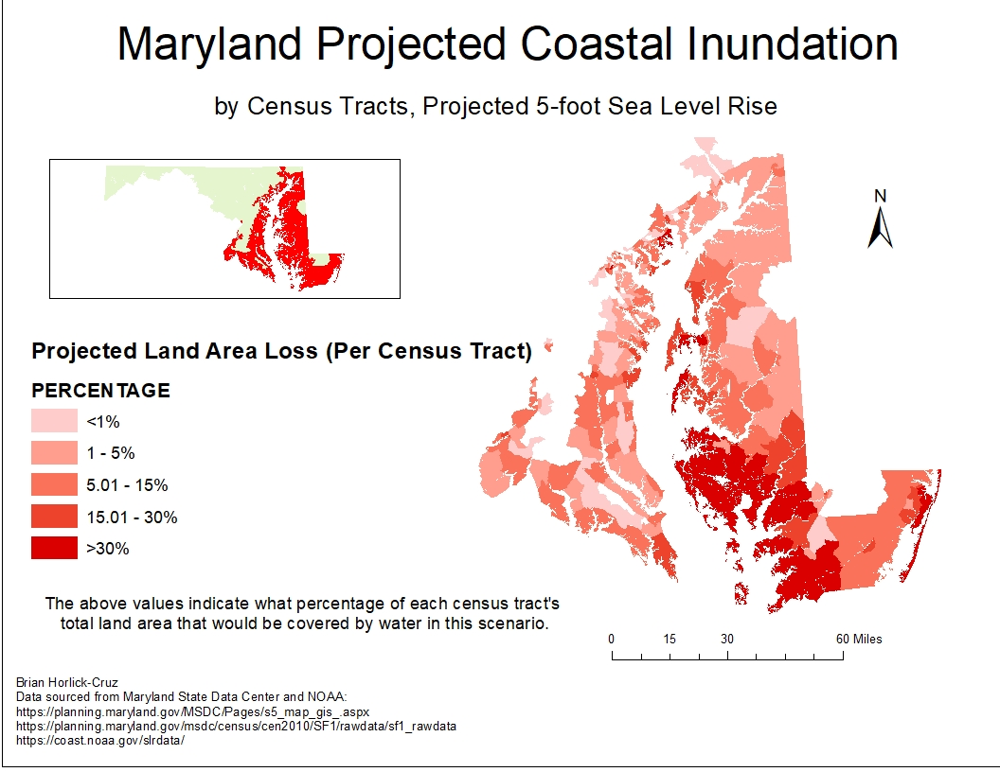
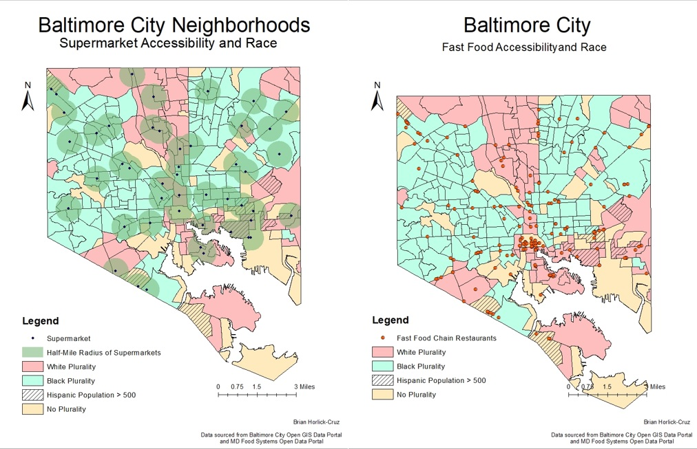
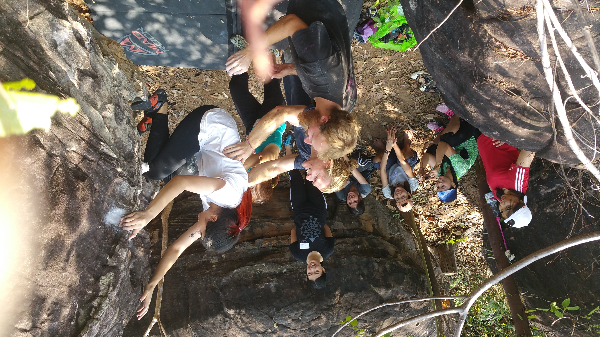
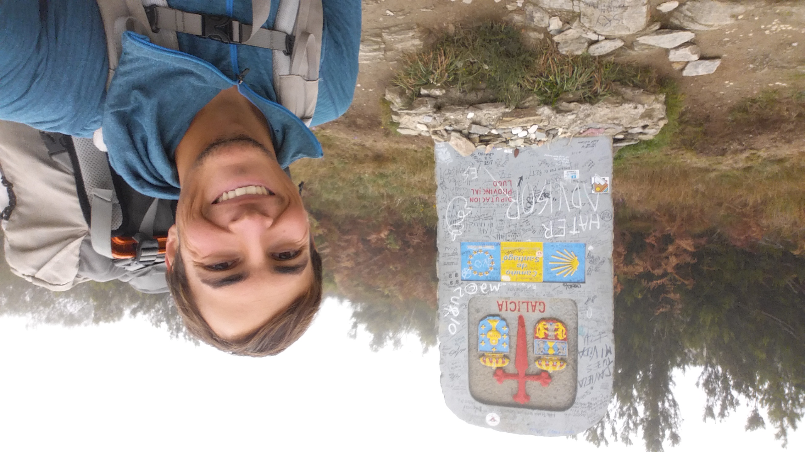

# Portfolio

---

## GIS Projects
---

---
### Covid-19 Rates and Outdoor Recreation in Maryland

This study visualized the changes in use of Maryland's green spaces during the COVID-19 Pandemic

---
### Social Vulnerability and Coastal Flooding in Eastern Maryland

Using a vulnerability index, this project assessed the social and physical consequences of sea level rise.

---
### Food Accessibility, Race, and Income in Baltimore City

This map assessed access to healthy foods based on density of various food resources at the neighborhood level.

---
## Other Projects
---
### Peace Corps Service
Learn about my Peace Corps service in Burkina Faso from 2016 - 2017.

---

## Expeditions 
---
Bouldering Development in  Northeast Thailand and the Himalaya

---
El Camino de Santiago: Lourdes to Porto

---
El Sendero de La Cordillera Huayhuash

---

