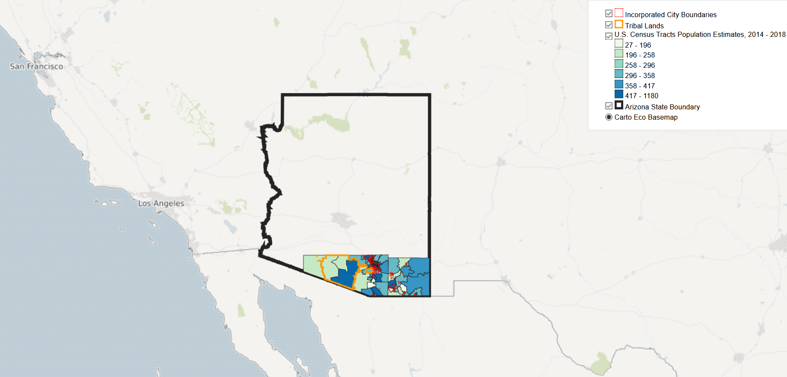

# Portfolio
---

## GIS Projects
---

### [Cities, Census Tracts, and Tribal Lands in Southern Arizona](lab5/lab5.html)

This webmap is setting the foundation for a future analysis of equity and access to Arizona's public lands.

---

### [9 Decades of Wyoming Energy Production](wyoming_energy/index.md)

Animating Wyoming's energy production developments from 1922 - 2011 using QGIS and GIMP

---

### [Covid-19 Rates and Outdoor Recreation in Maryland](covid_mapping/index.md)

This study visualized the relationships between outdoor recreation and local COVID-19 infection rates using regression analyses.

---

### [Social Vulnerability and Coastal Flooding in Eastern Maryland](coastal_flooding/index.md)

Using a vulnerability index, this project assessed the social and physical consequences of sea level rise.

---

### [Food Accessibility, Race, and Income in Baltimore City](food_maps/index.md)

A city with a long history of food access inequality, this project interrogated current accessibility of healthy food resources across Baltimore.

---

# Other Projects
---

### [Shriver Peaceworker Digital Stories](peaceworker/index.md)

Check out the digital stories I produced as part of my graduate fellowship at the University of Maryland, Baltimore County

---

### [Peace Corps Service](etude_project/project_page.md)

Learn about my Peace Corps service in Burkina Faso from 2016 - 2017

 

---

## Travels and Expeditions

[El Camino de Santiago: Lourdes to Porto](camino/index.md)

---

