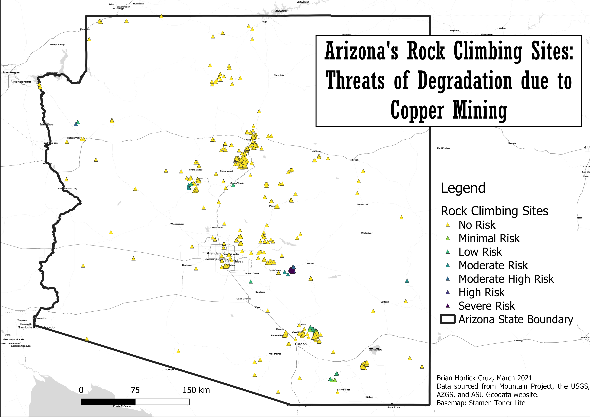

# Portfolio
---

## GIS Projects

---

### [Crag Equity: Rock Climbing Sites and Local Demographics in Arizona](486_final/index.md)

This project explored the relationships between sites of rock climbing activity and local demographics, including race/ethnicity, median individual income, and level of education at the census-tract leve.

---

### [Bivariate Mapping of Race/Ethnicity and Income](https://brianhcruz.github.io/lab8/lab_8_map/index.html#10/38.5148/-76.9565)

This webmap was produced using the Tidycensus & Biscale packages in R studio to create a bivariate variable to compare the median household income and estimated Hispanic/Latino populations of census tracts in Charles County, MD. 

---

### [Energy Production Facilities and Poverty Levels in Wyoming](lab6/index.md)

Using R and QGIS, this project explored the spatial relationships between County poverty levels and power production facilities in Wyoming with bivariate choropleth maps.

---

### [Rock Climbers vs. Big Copper](project1_486/index.md)

In light of recent battles over federally protected recreation resources in Arizona, this study aimed to assess the threat of mining-driven destruction of popular rock climbing destinations.

---

### [9 Decades of Wyoming Energy Production](wyoming_energy/index.md)

Animating Wyoming's energy production developments from 1922 - 2011 using QGIS and GIMP

---

### [Covid-19 Rates and Outdoor Recreation in Maryland](covid_mapping/index.md)

This study visualized the relationships between outdoor recreation and local COVID-19 infection rates using regression analyses.

---

### [Social Vulnerability and Coastal Flooding in Eastern Maryland](coastal_flooding/index.md)

Using a vulnerability index, this project assessed the social and physical consequences of sea level rise.

---

### [Food Accessibility, Race, and Income in Baltimore City](food_maps/index.md)

A city with a long history of food access inequality, this project interrogated current accessibility of healthy food resources across Baltimore.

---

# Other Projects
---

### [Peace Corps Service](etude_project/project_page.md)

Learn about my Peace Corps service in Burkina Faso from 2016 - 2017

 

---

## Travels and Expeditions

[El Camino de Santiago: Lourdes to Porto](camino/index.md)

---

