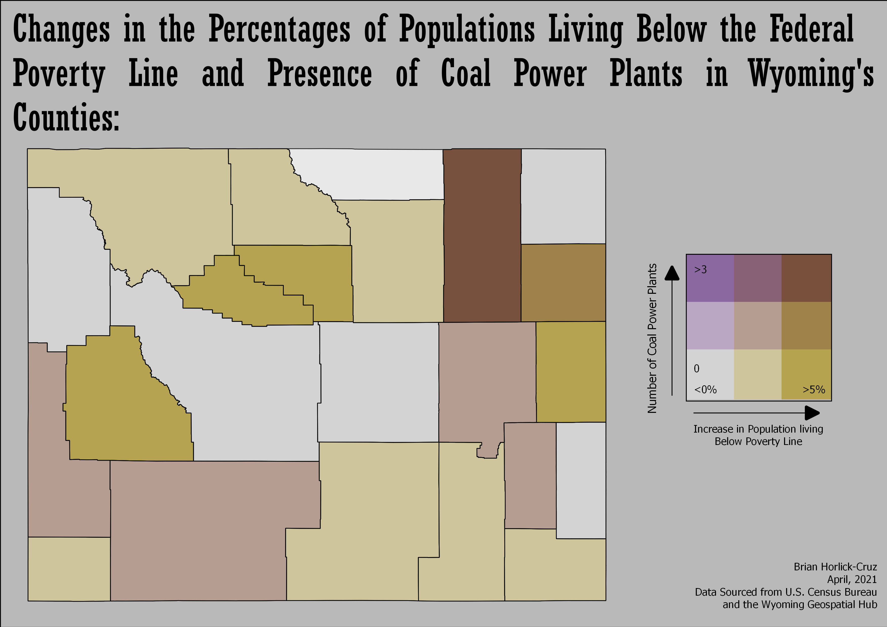

# Poverty Levels and Energy Production Facilities in Wyoming

## Setup

To begin, I loaded the packages required to download and process the data. The *tidyverse package* is a collection of other packages which facilitate general data science functions, while the *tidycensus* packages facilitate easy downloading of Census Bureau data for analysis and manipulation with *tidyverse* features. The *sf* package allows us to read and andencode spatial data in R. A personal API key is also needed to download Census Bureau data with the *tidyverse* package.

```{r}

library(tidyverse)
library(tidycensus)
library(sf)

# Adjust settings for tidycensus

options(tigris_class = "sf")
options(tigris_use_cache = TRUE)
census_api_key("XXXXXXX") #use your own personal API Key here

```
## Downloading Census Data

The next step was to download the data that would be necessary for the project. These were two variables from two ACS5 surveys: the *Total Income in the Past 12 months Below the Poverty Level* and *Total Population* data for every county in Wyoming. These variables were downloaded from the 2005 - 2009 ACS5 survey and the 2015 - 2019 ACS5 survey. Because only one set of geographic features is necessary for this project, only geospatial data were included for the 2015 - 2019 survey; the 2009 - 2005 data was exported only as a .CSV file. More information about these variables and others available through the ACS5 survey can be found in Social Explorer's Data Dictionary: https://www.socialexplorer.com/data/ACS2019_5yr/metadata/?ds=ACS19_5yr

```{r}
#Load ACS5 data from 2014 - 2019

wy_poverty_line_19 <- get_acs(geography = "county",
     variables = c("pop_below_pov_line" = "B17001_002", #total population below poverty line 
                   "pop" = "B01003_001" # total population
                   ), 
     year = 2019, #ACS5 datasets are identified by the final year of the survey period
     survey = "acs5", #data from ACS5 Survey
     state = c(56), #Wyoming's FIPS Code; all states have an associated fips code for census data
     county = c("Laramie County", "Natrona County", "Campbell County", "Sweetwater County", "Fremont County", "Albany County", "Park County", "Teton County", "Lincoln County","Carbon County", "Converse County", "Goshen County", "Big Horn County", "Sublette County", "Platte County", "Johnson County", "Washakie County", "Crook County", "Weston County", "Hot Springs County", "Niobrara County", "Uinta County", "Sheridan County"), #All individual counties' data must be downloaded
     geometry = TRUE, #downloads geospatial polygon features
     output = "wide") 

#Load ACS5 data from 2005 - 2009

wy_poverty_line_09 <- get_acs(geography = "county",
     variables = c("pop_below_pov_line" = "B17001_002", "pop"="B01003_001"), 
     year = 2009,
     survey = "acs5",
     state = c(56),
     county = c("Laramie County", "Natrona County", "Campbell County", "Sweetwater County", "Fremont County", "Albany County", "Park County", "Teton County", "Lincoln County","Carbon County", "Converse County", "Goshen County", "Big Horn County", "Sublette County", "Platte County", "Johnson County", "Washakie County", "Crook County", "Weston County", "Hot Springs County", "Niobrara County", "Uinta County", "Sheridan County"),
     geometry = FALSE, # indicates no geospatial features will be downloaded with the tabular data for this set.
     output = "wide") 


#set projection of shapefile to web mercator when saving--this is the most commonly used projection for webmaps.

st_write(st_transform(wy_poverty_line_19, 3857), "wy_pov_line_19.geojson") # geojson files are more universally readable than ESRI shapefiles.

#Because this file does not include geometry, no transformation is needed; it is saved as a .CSV.

st_write(wy_poverty_line_09, "wy_pov_line_09.csv")

```
## Calculate percentages of county populations whose earnings were below the federal poverty line

Because of the small population sizes of Wyoming's counties, using the percentages of the populations living in poverty provides a clearer picture of the scope and significance of any changes than raw numbers. To calculate this, I simply divided each county's total population of people living below the poverty line by their total populations. The function below generates a new column in each tabular dataset (labeled *per_pop*) which is then populated with these percentages.

```{r}

#Calculate percentage of county populations below poverty line

wy_poverty_line_19$per_pop <- wy_poverty_line_19$pop_below_pov_lineE/wy_poverty_line_19$popE #2015 - 2019 percentage of pop. below poverty line

wy_poverty_line_09$per_pop <- wy_poverty_line_09$pop_below_pov_lineE/wy_poverty_line_09$popE #2005 - 2009 percentage of pop below poverty line


```

## Join the two files and calculate the change over time in percentages of the population whose earnings were below the federal poverty line.

Finally, a new dataset was created by joining the data from our two starting ones. This one is labeled *wy_poverty_line*, and is made by executing a left join to pair the tables based on a common variable (GEOID). The last transformation entailed calculating the change over time in the poverty levels of the counties, done by subtracting the 2005 - 2009 data from the 2015 - 2019 data. This generated a new column (labeled *change*) which displays the net change in percentage of people who earned poverty wages. Positive percentages show increases in poverty levels, while negative ones indicate decreases.

```{r}

# Merge the files in order to combine data from the two time periods

wy_poverty_line <- left_join(wy_poverty_line_19, wy_poverty_line_09,
                                  by="GEOID",
                                  suffix = c(".19", ".09")) #labels column headers according to their respective survey data sets (i.e. 2019 = .19)

# Calculate the changes in poverty levels over time by subracting the 2005 - 2009 data from the 2015 - 2019 data.

wy_poverty_line$change <- wy_poverty_line$per_pop.19 -
        wy_poverty_line$per_pop.09

wy_poverty_line <- st_transform(wy_poverty_line, 3857) # Reproject the shapefile to 3857 (web mercator)

#Save the data as a .geojoson file which can be imported into QGIS for map generation.

st_write(wy_poverty_line, "wy_pov_change.geojson")
```

## Analysis in QGIS

The poverty level data was imported into QGIS as a set of polygons. Two new sets of polygons displaying the counts of wind and coal energy production plants were then created using the *count points in polygons* tool. These poygon layers were then laid over the polygons with the poverty level data and each were symbolized in complementary graduated color schemes based on examples by [Joshua Stevens](https://www.joshuastevens.net/cartography/make-a-bivariate-choropleth-map/). The power production count layers were rendered with the *multiply* option which blends the colors of both top and bottom layers, and then bivariate legends were generated with the *bivariate legend* plugin.




17 of Wyoming's 23 counties saw increases in estimates of people earning wages below the poverty line between the 2005 - 2009 and 2015 - 2019 ACS5 study periods. Of these 17, 5 featured coal-fueled power plants: Weston County (1 coal power plant, 6.6% increase in poverty), Campbell County (7 coal power plants, 6% increase in poverty), Sweetwater County (3 coal power plants, 4% increase in poverty), Converse County (1 coal power plant, 2.8% increase in poverty), and Platte County (1 coal power plant, 2.7% increase in poverty). 5 counties with wind energy power plants additionally saw increase in poverty, but generally to lesser degrees of severity: Converse County (1 wind farm, 2.8% increase in poverty), Carbon County (5 wind farms, 2.8% increase in poverty), Uinta County (2 wind farms, 0.9% increase in poverty), Laramie County (0.4% increase in poverty), and Albany County (0.07% increase in poverty). No coal-fueled power production sites were located in counties that saw decreases in poverty, while one wind farm was located in Natrona County, which saw a .005% decrease.

These findings point to an association between the presence of wind farms and reduction in the negative economic ramifications of coal divestment, as all of the counties with wind farms saw lower rises in poverty levels and Converse County, which had one of each type of power plant, saw a lower rise than 3 of the four that did not have wind farms. While there are many other factors that may relate to poverty levels and changing power production infrastructure, such as political and corporate opposition, this can be seen as strengthening the case of wind energy as at least reducing the economic burden of coal energy divestment.
