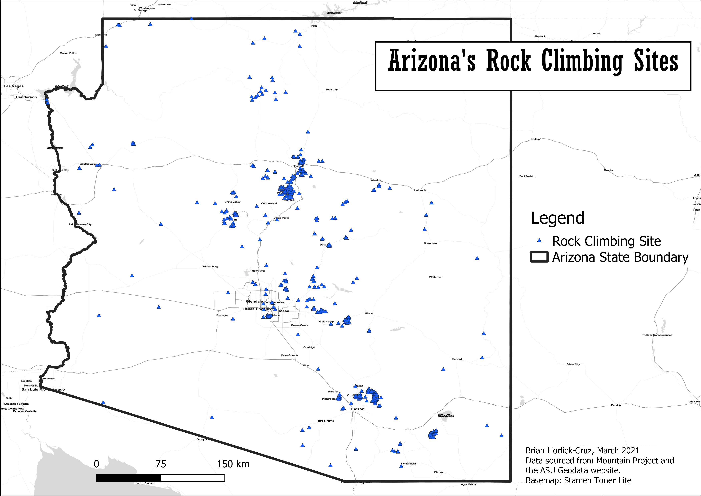
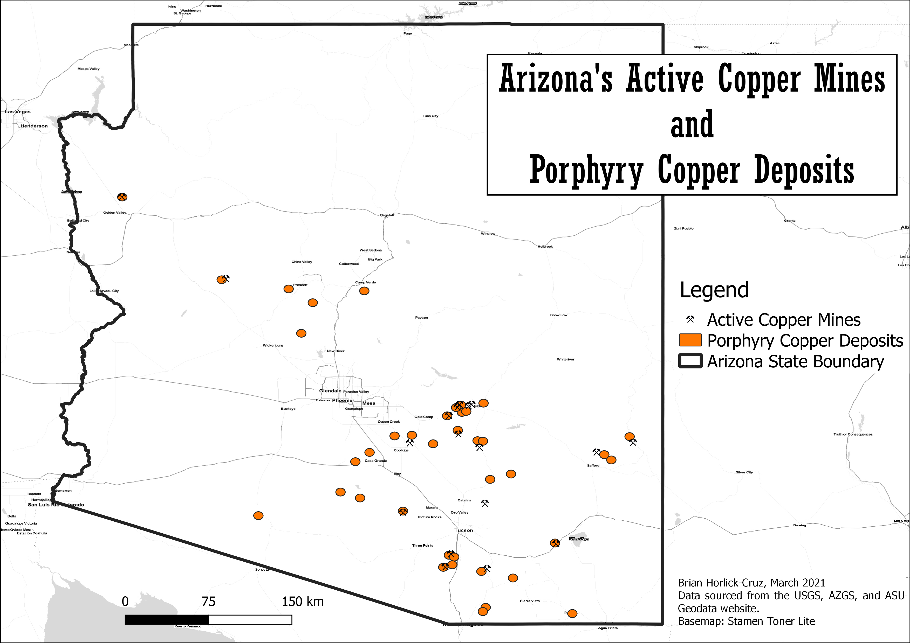
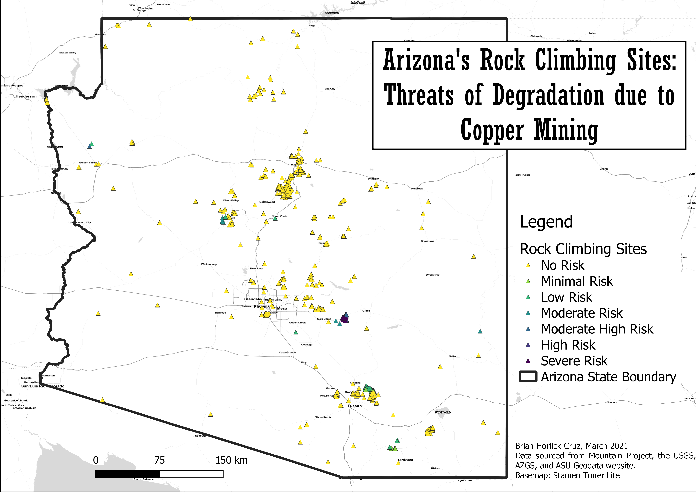

In early March, 2021, the U.S. Forest Service made a last-minute decision to temporarily halt the transfer of over 2,000 acres of Arizona’s federally protected public land to the Resolution Mining Company. Known as Oak Flat, this area is sacred to local Indigenous groups and a popular destination for rock climbers, both of whom were instrumental in the lobbying efforts to block the land transfer which was greenlit in the final days of the Trump administration (Access Fund, 2021). Oak Flat was targeted for mining activity due to its location on top of a porphyry copper deposit—the most common type in the state. Being exceedingly rich in these deposits, Arizona produces over 68% of the United States’ domestic copper resources and has numerous deposits that remain untapped (University of Arizona, n.d.). Knowing the economic potential of these sites, the conservative political leadership of the state has been aggressively pursuing legislation that will transfer federal public lands to state control, relaxing environmental and historical protections and opening them up to extractive uses. 8 bills aimed at transferring public land controls to the state government have been introduced to the Arizona statehouse in recent years, causing growing unease among outdoor recreationists and Indigenous Americans (Protect Our Public Land, n.d.). Inspired by the recent events at Oak Flat, this study aimed to assess the overall risks that potential copper mining operations pose to the rest of Arizona’s rock climbing sites.

Data on Arizona’s rock climbing sites were collected from [Mountain Project](https://www.mountainproject.com/) using the “Export CSV” function of the Route Finder feature. Over 150 CSV files were generated, representing the 10,935 climbing routes that are documented on the state’s web pages. These were then joined into one master registry for further processing. Point data on global porphyry copper deposits were sourced from the United States [Geological Service website](https://mrdata.usgs.gov/porcu/), while point data on active mining sites were retrieved from the [Arizona Geological Survey](http://repository.azgs.az.gov/facets/results/active%20mines). A state boundary shapefile was additionally sourced from the [ASU Geodata website](https://geodata-asu.hub.arcgis.com/datasets/arizona-state-boundary?geometry=-128.619%2C30.977%2C-95.242%2C37.335)

Data were then processed in QGIS. The point data for rock climbing routes were first dissolved based on an attribute indicating their locations, which in this case were particular climbing features such as cliffs, small mountains, and boulders fields. Copper deposits were clipped to display only those within Arizona state lines, while active copper mines were extracted from the AZGS active mine file. Ultimately, 1,711 distinct climbing features were mapped along with 39 porphyry copper deposits and 18 active copper mines. 

### Click any of the images below for an interactive webmap.

Figure 1-Established Rock Climbing Sites in Arizona
 

Figure 2- Porphyry Copper Deposits and Active Copper Mines in Arizona. Copper deposits are shown with 5-kilometer buffers.

For the analysis, the distance between both rock climbing sites and porphyry deposits and rock climbing sites and active mines were measured using QGIS’s “distance to nearest hub” tool. This produced two new point datasets which included these distance measures. New variables were then created to categorize the potential threats that mining activities pose to climbing sites based on their proximity to copper deposits and mines. These categories were assigned values of 0 – 3 and labeled as: high risk (within 5,000 meters of mines or deposits); moderate risk (within 5,001 – 8,000 meters); low risk (8,001 – 10,000 meters); and no risk (more than 10,000 meters away). The attribute tables of these two datasets were thereafter joined, and the two risk fields (risk from deposits and risk from active mines) were added together to create a cumulative risk field. These categories ranged in values from 0 – 6, with 6 being climbing sites with the highest proximity to copper deposits and active mining operations.

Figure 3- Climbing Sites Displayed by Risk of Degradation by Copper Mining Activity

Based on this assessment, 287 climbing features were deemed to be threatened by copper mining activities in some capacity, with 79 features categorized as being at severe risk, 14 high risk, and 16 moderate-high risk. Queen Creek Canyon—the name given to the broader area in which Oak Flat is situated—is home to virtually all of the highest-risk climbing sites. Only one of 109 features in the three highest risk categories was outside of the canyon (the Chloride Boulders in the Cerbat Mountains, near Kingman, AZ). The 15 moderate-risk sites are more variably located, with 6 of them in Copper Basin near Prescott, 6 within Tucson’s Mount Lemmon, and one each in Picket Post Canyon, Wood Canyon, and Chase Creek. Mount Lemmon has the majority of low-risk sites, along with ones at Dry Canyon, the Cerbat Mountains, Copper Canyon, The Biscuit, and the Farmhouse.
	
Certain important limitations must be noted, given these results. Firstly, Mountain Project’s databases are almost always incomplete in scope, as they are collectively updated and maintained by community contributors. Frequently, certain areas are deliberately kept off of the site in order to reduce visitation by non-locals, whereas many other locations throughout the state remain underexplored and may become climbing destinations in the future. This analysis is thus representative of the most well-known rock climbing sites in Arizona and can be used as a reference for future climbing developments. Moreover, porphyry copper deposits and mining site data were only available as points, with their precise geographic bounds not clearly established. 5-kilomter buffers were thus used to estimate the total area which may be exploited for mining purposes. Nonetheless, these estimates should provide reliable guidelines for areas which warrant high priorities in the struggle to protect Arizona’s public recreation resources in the immediate future. Finally, Arizona has additional copper deposits with different geological qualities different from porphyry ones; however, data on these sites was unavailable. It is thus possible that more climbing resources are at risk than has been determined here.
