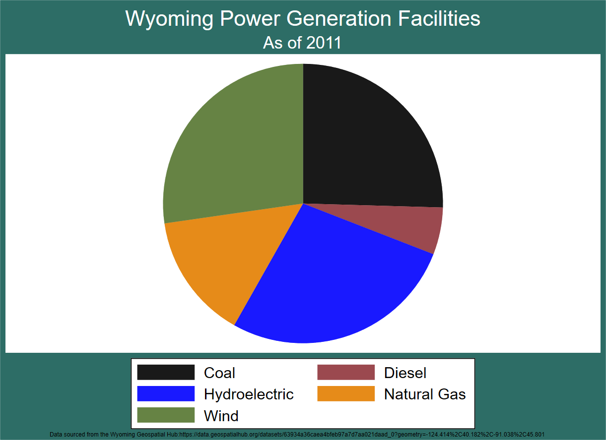

## Where our power comes from matters.

While well-known for being the United States' largest coal producer, Wyoming boasts a variety of power production plants that serve the Mountain West and Pacific States. The proportions of power production types are displayed in the pie chart below, which was made using Stata.

This animation was made using data on power generation facilities from the Wyoming Geospatial Hub, which were imported into QGIS and symbolized to display power generation sites by their primary energy source. The QGIS query builder was used to create maps showing select sites as they were developed over time, with a final set of 9 maps being created and animated in GIMP.

